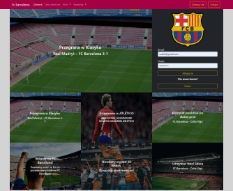
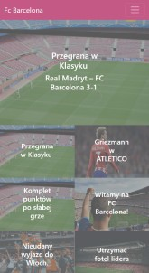
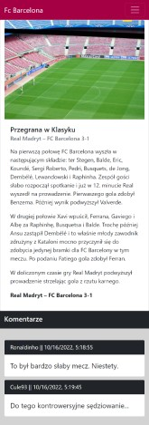
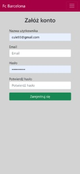
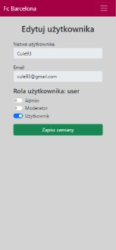
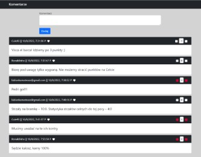
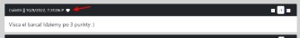
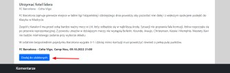
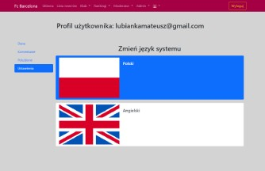

# FC Barcelona Forum.
> Hi everyone! This is my FC Barcelona forum. 

## Live
https://barcelona-forum.herokuapp.com

## Technologies:
* Node JS
* Java Script
* EJS
* SCSS
* Express JS
* Mongodb
* Mongoose
* Firebase

## General info
This is my FC Barcelona forum. I've created it to develop my node js skills. 

## Screenshots
  
  
  

## Brief description of the system

### User authentication
As a user, you can register and then log in to your account.

#### Registration

#### Login

### User roles
Users can be assigned different roles: administrator, moderator or regular user. 
The administrator can edit user roles.  

### News
Administrators and moderators can add and edit news.  

### Comments
Users can add comments and then rate other users comments.  

They can also add comments and news to the favorites list.  
  

### Language versions of the website
Users can choose one of two language versions (Polish, English)  

## Contact
Created by [lubiankamateusz@gmail.com] - feel free to contact me!